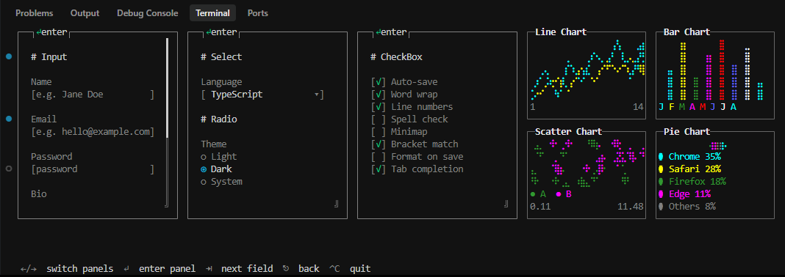

## @ice1/glyphx

💻 The terminal environment was fantastic and beautiful.

### Installation

```bash
npm install @ice1/glyphx
```

### Usage

```typescript
import {
    Cursor,
    Screen,
    Input,
    Button,
    Container,
    ContainerGroup,
    Select,
    Radio,
    CheckBox,
    Label,
    Event,
    ContainerStyle,
    Textarea,
} from "../src";
import * as readline from "readline";
import chalk from "chalk";

const screen = new Screen();
screen.enter();
process.stdin.setRawMode(true);
Cursor.hide();

const S: ContainerStyle = { width: 32, height: 16 };

// ─── Container 1 : Input fields ───────────────────────────────────────────────
const inputName = new Input(24, "e.g. Jane Doe");
const inputEmail = new Input(24, "e.g. hello@example.com");
const inputPass = new Input(24, "password", "password");
const inputBio = new Textarea(24, 6, "", "Input your bio");
const submitBtn = new Button(24, "Submit", "primary", () => {}, render);

const c1 = new Container(S, [
    new Label(""),
    new Label("# Input", "white"),
    new Label(""),
    new Label("Name", "gray"),
    inputName,
    new Label(""),
    new Label("Email", "gray"),
    inputEmail,
    new Label(""),
    new Label("Password", "gray"),
    inputPass,
    new Label(""),
    new Label("Bio", "gray"),
    inputBio,
    new Label(""),
    submitBtn,
]);

// ─── Container 2 : Select + Radio ─────────────────────────────────────────────
const selectLang = new Select(
    24,
    ["TypeScript", "Rust", "Go", "Python", "C++"],
    0,
);

const radioTheme = new Radio(["Light", "Dark", "System"], 1);

const c2 = new Container(S, [
    new Label(""),
    new Label("# Select", "white"),
    new Label(""),
    new Label("Language", "gray"),
    selectLang,
    new Label(""),
    new Label("# Radio", "white"),
    new Label(""),
    new Label("Theme", "gray"),
    radioTheme,
]);

// ─── Container 3 : CheckBoxes ──────────────────────────────────────────────────
const checks = [
    new CheckBox("Auto-save", true),
    new CheckBox("Word wrap", true),
    new CheckBox("Line numbers", true),
    new CheckBox("Spell check", false),
    new CheckBox("Minimap", false),
    new CheckBox("Bracket match", true),
    new CheckBox("Format on save", false),
    new CheckBox("Tab completion", true),
];

const c3 = new Container(S, [
    new Label(""),
    new Label("# CheckBox", "white"),
    new Label(""),
    ...checks,
]);

const allContainers = [c1, c2, c3];
const group = new ContainerGroup(allContainers);

const COLS = [1, 34, 67] as const;

function render(): void {
    for (let i = 0; i < allContainers.length; i++) {
        allContainers[i]!.renderAt(1, COLS[i] ?? 1);
    }
    Cursor.moveTo(20, 1);
    process.stdout.write(
        chalk.gray("  ←/→ ") +
            chalk.white("switch panels") +
            chalk.gray("  ↵ ") +
            chalk.white("enter panel") +
            chalk.gray("  ⇥ ") +
            chalk.white("next field") +
            chalk.gray("  ⎋ ") +
            chalk.white("back") +
            chalk.gray("  ⌃C ") +
            chalk.white("quit"),
    );
}

render();

const event = new Event(process, screen);
event.add({
    name: "main",
    next(key: readline.Key) {
        group.handleKey(key);
        render();
    },
});
event.setup();
```

### Run

```bash
npm run test
```

### ScreenShot


